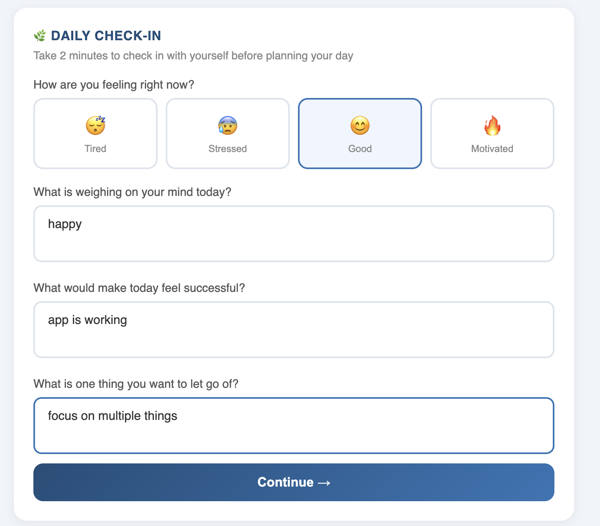
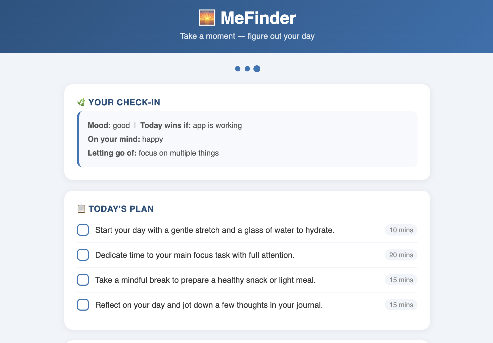
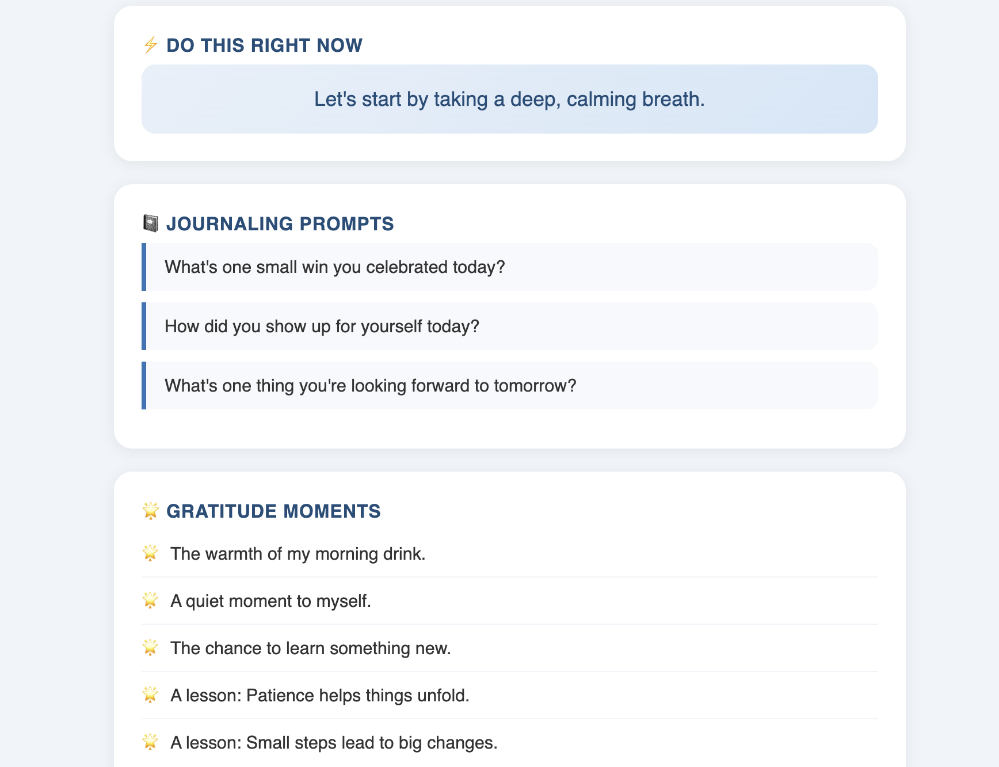

# 🌅 MeFinder
### "Find your day before it finds you."
MeFinder is an AI-powered daily routine and journaling planner that helps you pause, reflect, and intentionally design your day — before the day designs you.

---

## 🚀 Live Demo
👉 [https://shaiju786.github.io/meFinder/](https://shaiju786.github.io/meFinder/)

## 🎥 Demo Video
👉 [Watch MeFinder Demo Video](https://drive.google.com/file/d/1Jpjj4hpLYWqr34p7_87LJ_epPR_grCwQ/view?usp=drive_link)

---

## 💡 What It Does
Most people wake up and react to whatever comes at them. MeFinder gives you 2-3 minutes of clarity to decide:
- Who am I showing up for today?
- How much energy do I have?
- What actually matters today?

---

## 🔄 How It Works

**Step 1 — Daily Check-In**
Answer 4 simple questions about your mood, what is on your mind, what success looks like today, and what you want to let go of.

**Step 2 — Set Your Mode**
Choose who you are planning for — Self, Parents, Kids, or Family & Friends. Select your available time and focus area.

**Step 3 — Get Your Plan**
AI generates a personalised Today's Plan, journaling prompts, gratitude moments, and a next step for tomorrow.

---

## 🛠 Tech Stack

| Tool | Purpose |
|---|---|
| Dify | AI workflow — LLM node with structured JSON output |
| n8n Cloud | Automation — connects Dify to the web app |
| HTML / CSS / JS | Frontend web interface |
| GitHub Pages | Free hosting and deployment |

---

## 📸 Screenshots

### Step 1 — Daily Check-In


### Step 2 — Mode Selection


### Step 3 — Focus Selection


### Step 4 — AI Generated Plan


### Step 5 — Gratitude Moments


### Step 6 — Tomorrow's Next Step


---

## 🏆 AI Application Challenge 2026
- **Participant:** Shaiju Shajahan
- **Path:** No-Code / Low-Code
- **Category:** Daily Productivity & Wellbeing

---

## 📁 Repository Structure

```
meFinder/
├── index.html        # Complete web app — UI, logic, API integration
├── README.md         # Project documentation
└── screenshots/      # App screenshots
    ├── Check-in.png
    ├── Mode Selection.png
    ├── Focus Selection.png
    ├── Planner.png
    ├── Gratitude.png
    └── Next Step.png
```
---
## 🛡️ Safety Features

- **Input sanitization** — User inputs are cleaned before being sent to the AI
- **Prompt injection protection** — System prompt prevents malicious instruction overrides
- **JSON response validation** — AI output is validated before displaying to user
- **No medical advice** — AI is instructed never to provide medical, mental health or financial advice
- **User-friendly error handling** — Clear messages shown if AI fails to respond
- **Medical disclaimer** — Displayed in app footer and README
- **HTTPS** — All connections secured via GitHub Pages
- **No data storage** — User inputs are never stored or logged
  ---

## 🚀 Future Improvements

- User login and personal history
- Weekly summary and progress tracking
- End of day reflection feature
- Habit tracker integration
- Mobile app version
- Share your plan on WhatsApp
- Voice input support
- Celebration animation when all tasks completed

---

## 👨‍💻 Developer

**Shaiju Shajahan**
AI Application Challenge 2026 — No-Code / Low-Code Path
GitHub: [Shaiju786](https://github.com/Shaiju786)

---
## ⚠️ Disclaimer
MeFinder is a personal productivity tool built for the AI Application Challenge 2026. AI-generated plans are for guidance only and should not replace professional medical, mental health, or financial advice.
